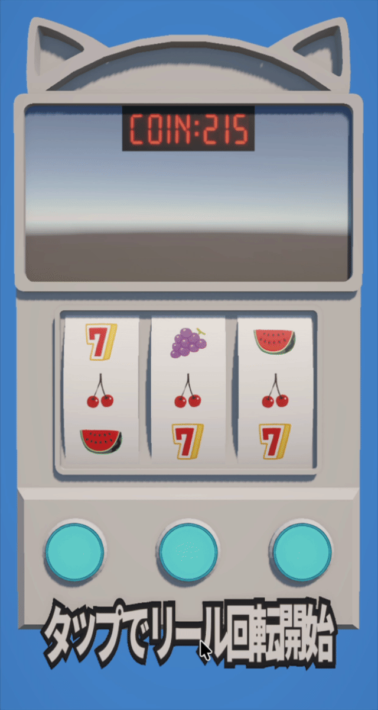

# CasualBonusSlot

A simple slot game built with Unity, R3, and MVP architecture.



## Overview

A casual 1-line slot game that requires no timing skills. Built with reactive programming using R3 and clean MVP architecture.

## Game Features

- **Single Line**: Middle row only
- **Auto Bet**: 1 coin per game
- **Symbols**: Bonus (777), Bell, Cherry
- **Cut-in Effects**: Dynamic presentation based on lottery results
- **Haptics**: Touch feedback support (WebGL only)

For detailed probabilities and payout information, see [docs/game-balance.md](docs/game-balance.md).

## Tech Stack

- **Unity**: 6.0 or later
- **Target Platform**: WebGL (primary), with mobile/desktop support
- **R3**: Reactive programming library (Cysharp)
- **Architecture**: MVP (Model-View-Presenter)
- **Haptics**: WebGL native plugin integration via JavaScript library (.jslib)

## Architecture

### MVP + R3 Layers

```
       [User Input]
            ↓
┌────────────────────────┐
│   View (MonoBehaviour) │ → UI rendering & effects
│   - Subject (emit)     │
└────────────────────────┘
            ↓
┌────────────────────────┐
│  Presenter (Stateless) │ → Subscribe & forward only
│   - No logic/state     │
└────────────────────────┘
            ↓
┌────────────────────────┐
│  Model (Pure C#)       │ → State & business logic
│   - ReactiveProperty   │
│   - Subject (events)   │
└────────────────────────┘
```

### Why MVP + R3?

**MVP (Model-View-Presenter)**
- Clear separation of concerns
- Model is completely independent of Unity (testable, reusable)
- View focuses solely on UI and effects
- Presenter is just a thin connector with zero logic

**R3 (Reactive Extensions)**
- Declarative event flow (no callbacks hell)
- Built-in automatic disposal management
- Type-safe observable streams
- Perfect fit for Unity's lifecycle management

### Core Design Principles
1. **All state and logic centralized in Models**
2. **Presenters are completely stateless** (no if/switch/for statements)
3. **One-way Model nesting is allowed**

## Documentation

Detailed specifications and architecture design are available in `/docs`:

- [docs/game-balance.md](docs/game-balance.md) - Probabilities and payouts
- [docs/overview.md](docs/overview.md) - Game specifications
- [docs/game-flow.md](docs/game-flow.md) - Game flow diagram
- [docs/architecture.md](docs/architecture.md) - Architecture design

## Project Structure

```
Assets/Scripts/
├── Models/           # Business logic & state management
│   ├── Core/         # Core business logic models
│   ├── Events/       # Event structures
│   └── Definitions/  # Enum definitions
├── Views/            # UI & effects (MonoBehaviour)
├── Presenters/       # Model-View bridge (stateless)
└── UI/               # UI utilities
```

## Setup

1. Install Unity 6 or later
2. Clone this repository
3. Open with Unity
4. R3 will be installed automatically via Package Manager
5. Import TextMeshPro (if prompted):
   - Unity will automatically prompt to import TMP Essentials on first scene open
   - Or manually: `Window > TextMeshPro > Import TMP Essential Resources`

## Controls

### Editor / PC
- **Space** or **Mouse Click**: Pull lever (start reel spin)
- **1, 2, 3**: Stop each reel

### Mobile / WebGL
- **Tap Screen**: Pull lever (start reel spin)
- **Tap Buttons**: Stop each reel

## Development Status

- ✅ Model layer (business logic complete)
- ✅ Presenter layer (stateless implementation)
- ✅ View layer (UI, animations, effects implemented)
