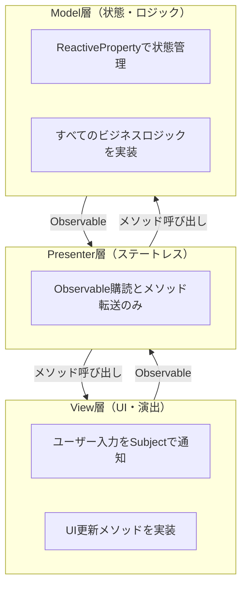
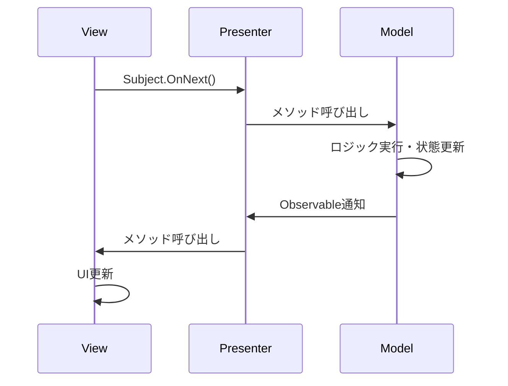
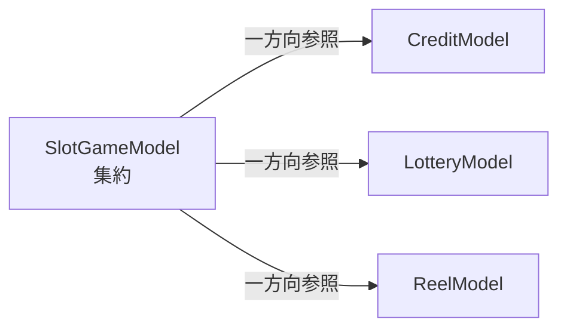

# アーキテクチャ設計書

## 1. 概要

本プロジェクトは、**R3ベースのリアクティブプログラミング**を採用した**MVP（Model-View-Presenter）パターン**で実装されています。

**設計の核心**
- すべての状態とロジックをModelに集約
- Presenterは完全にステートレス（if/switchなどの制御構文を一切使わない）
- Modelのネストは一方向参照なら許容

---

## 2. 基本構造



### データフロー



---

## 3. 各層の責務

### Model層

**責務**
- 状態を`ReactiveProperty<T>`で保持
- すべてのロジック（抽選、計算、判定など）を実装
- 状態変化・イベントを`Subject<T>`で通知

**設計原則**
- Viewへの依存禁止（MonoBehaviourに依存しない）
- 外部には`ReadOnlyReactiveProperty<T>`で公開
- 一方向参照のModelネストは許容

**実装例**
```csharp
public class ExampleModel
{
    private ReactiveProperty<int> _value = new ReactiveProperty<int>(0);
    public ReadOnlyReactiveProperty<int> Value => _value;

    private Subject<Unit> _onEvent = new Subject<Unit>();
    public Observable<Unit> OnEvent => _onEvent;

    public void Execute()
    {
        _value.Value += 10;
        _onEvent.OnNext(Unit.Default);
    }
}
```

**Modelのネスト**



---

### View層

**責務**
- ユーザー入力を`Subject<T>`で発行
- UI更新メソッドを実装（Presenterから呼ばれる）
- 演出実行（アニメーション、エフェクトなど）

**設計原則**
- Modelへの直接アクセス禁止
- ビジネスロジックを実装しない
- 入力検知と表示更新のみに専念

**実装例**
```csharp
public class ExampleView : MonoBehaviour
{
    private Subject<Unit> _onButtonClicked = new Subject<Unit>();
    public Observable<Unit> OnButtonClicked => _onButtonClicked;

    public void OnButtonClick()
    {
        _onButtonClicked.OnNext(Unit.Default);
    }

    public void UpdateDisplay(string text)
    {
        textComponent.text = text; // ロジックなし
    }
}
```

---

### Presenter層

**責務**
- ObservableをSubscribeして、ViewとModelを接続

**設計原則（最重要）**
- 完全にステートレス（状態を持たない）
- if/switch/forなどの制御構文を**一切使わない**
- Observable購読とメソッド呼び出しのみ

**実装例**
```csharp
public class GoodPresenter
{
    public GoodPresenter(ExampleView view, ExampleModel model)
    {
        // View → Model
        view.OnButtonClicked
            .Subscribe(_ => model.Execute())
            .AddTo(_disposables);

        // Model → View
        model.Value
            .Subscribe(value => view.UpdateDisplay($"Value: {value}"))
            .AddTo(_disposables);

        model.OnEvent
            .Subscribe(_ => view.PlayEffect())
            .AddTo(_disposables);
    }
}
```

---

## 4. R3主要型

| 型 | 用途 | 使用場所 |
|---|---|---|
| `ReactiveProperty<T>` | 状態保持（内部） | Model内部 |
| `ReadOnlyReactiveProperty<T>` | 状態公開（読み取り専用） | Model → 外部 |
| `Subject<T>` | イベント発行 | View・Model |
| `Observable<T>` | イベント購読 | Presenter |
| `Subscribe()` | 購読 | Presenter |
| `AddTo(CompositeDisposable)` | 自動解除 | Presenter |

---

## 5. よくある間違い

### ❌ Presenterが状態を持つ

```csharp
// ❌ 悪い例
public class BadPresenter
{
    private bool _isPlaying = false; // ❌

    public BadPresenter(...)
    {
        _view.OnStartButton.Subscribe(_ =>
        {
            _isPlaying = true; // ❌
            _model.Start();
        });
    }
}
```

```csharp
// ✅ 正しい例（状態はModelに）
public class GoodModel
{
    private ReactiveProperty<bool> _isPlaying = new ReactiveProperty<bool>(false);
    public ReadOnlyReactiveProperty<bool> IsPlaying => _isPlaying;

    public void Start()
    {
        _isPlaying.Value = true;
    }
}
```

---

### ❌ Presenterがロジックを持つ

```csharp
// ❌ 悪い例
public class BadPresenter
{
    public BadPresenter(...)
    {
        _view.OnButtonClicked.Subscribe(_ =>
        {
            if (_model.Credit.CurrentValue > 0) // ❌
            {
                _model.Bet();
            }
            else
            {
                _view.ShowError();
            }
        });
    }
}
```

```csharp
// ✅ 正しい例（ロジックはModelに、結果をイベントで通知）
public class GoodModel
{
    private Subject<Unit> _onBetFailed = new Subject<Unit>();
    public Observable<Unit> OnBetFailed => _onBetFailed;

    public void TryBet()
    {
        if (_credit.CurrentValue > 0)
        {
            _credit.Value -= 1;
        }
        else
        {
            _onBetFailed.OnNext(Unit.Default);
        }
    }
}

public class GoodPresenter
{
    public GoodPresenter(...)
    {
        _view.OnButtonClicked
            .Subscribe(_ => _model.TryBet())
            .AddTo(_disposables);

        _model.OnBetFailed
            .Subscribe(_ => _view.ShowError())
            .AddTo(_disposables);
    }
}
```

---

### ❌ Viewがロジックを持つ

```csharp
// ❌ 悪い例
public class BadView : MonoBehaviour
{
    public void OnButtonClick()
    {
        if (_presenter.GetCredit() > 0) // ❌
        {
            _presenter.StartGame();
        }
    }
}
```

```csharp
// ✅ 正しい例（Viewは入力を通知するだけ）
public class GoodView : MonoBehaviour
{
    private Subject<Unit> _onButtonClicked = new Subject<Unit>();
    public Observable<Unit> OnButtonClicked => _onButtonClicked;

    public void OnButtonClick()
    {
        _onButtonClicked.OnNext(Unit.Default);
    }
}
```

---

## 6. チェックリスト

### Model
- [ ] すべての状態を`ReactiveProperty<T>`で管理
- [ ] 外部に`ReadOnlyReactiveProperty<T>`で公開
- [ ] MonoBehaviourへの依存なし

### View
- [ ] ユーザー入力を`Subject<T>`で発行
- [ ] Modelへの直接アクセスなし
- [ ] UI更新メソッド内にビジネスロジックなし

### Presenter
- [ ] 状態を保持していない
- [ ] if/switch/forを使っていない
- [ ] Subscribe+メソッド呼び出しのみ
- [ ] すべてに`.AddTo(_disposables)`
