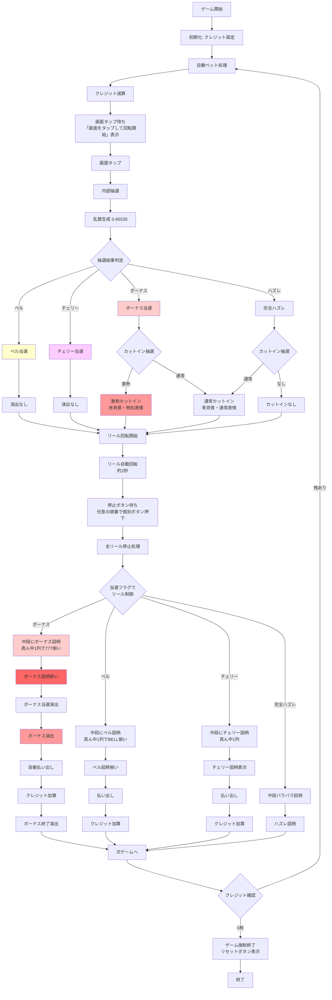

# Game Flow

**注**: 具体的な確率や払い出し枚数については [game-balance.md](game-balance.md) を参照してください。

```mermaid
graph TD
    Start[ゲーム開始] --> Init[初期化: クレジット設定]
    Init --> AutoBet[自動ベット処理]

    AutoBet --> DeductCredit[クレジット減算]

    DeductCredit --> WaitTap[画面タップ待ち<br/>「画面をタップして回転開始」表示]
    WaitTap --> ScreenTap[画面タップ]

    ScreenTap --> InternalLottery[内部抽選]

    InternalLottery --> RandGen[乱数生成 0-65535]
    RandGen --> JudgeResult{抽選結果判定}

    JudgeResult -->|ベル| BellWin[ベル当選]
    JudgeResult -->|チェリー| CherryWin[チェリー当選]
    JudgeResult -->|ボーナス| BonusWin[ボーナス当選]
    JudgeResult -->|ハズレ| CompleteLose[完全ハズレ]

    BonusWin --> CutinLottery1{カットイン抽選}
    CutinLottery1 -->|激熱| HotCutin[激熱カットイン<br/>赤背景・特別表情]
    CutinLottery1 -->|通常| NormalCutin[通常カットイン<br/>青背景・通常表情]

    BellWin --> NoEffect1[演出なし]
    CherryWin --> NoEffect2[演出なし]

    CompleteLose --> CutinLottery2{カットイン抽選}
    CutinLottery2 -->|通常| NormalCutin
    CutinLottery2 -->|なし| NoCutin[カットインなし]

    HotCutin --> StartReel[リール回転開始]
    NormalCutin --> StartReel

    NoEffect1 --> StartReel
    NoEffect2 --> StartReel
    NoCutin --> StartReel

    StartReel --> AutoSpin[リール自動回転<br/>約2秒]

    AutoSpin --> WaitStop[停止ボタン待ち<br/>任意の順番で個別ボタン押下]

    WaitStop --> StopAll[全リール停止処理]

    StopAll --> SlideControl{当選フラグで<br/>リール制御}

    SlideControl -->|ボーナス| SlideToBonus[中段にボーナス図柄<br/>真ん中1列で777揃い]
    SlideControl -->|ベル| SlideToBell[中段にベル図柄<br/>真ん中1列でBELL揃い]
    SlideControl -->|チェリー| SlideToCherry[中段にチェリー図柄<br/>真ん中1列]
    SlideControl -->|完全ハズレ| SlideToLose[中段バラバラ図柄]

    SlideToBonus --> ShowBonus[ボーナス図柄揃い]
    SlideToBell --> ShowBell[ベル図柄揃い]
    SlideToCherry --> ShowCherry[チェリー図柄表示]
    SlideToLose --> ShowLose[ハズレ図柄]

    ShowBonus --> BonusEffect[ボーナス当選演出]
    BonusEffect --> BonusProduction[ボーナス演出]

    ShowBell --> PayBell[払い出し]
    PayBell --> AddCredit1[クレジット加算]
    AddCredit1 --> NextGame[次ゲームへ]

    ShowCherry --> PayCherry[払い出し]
    PayCherry --> AddCredit2[クレジット加算]
    AddCredit2 --> NextGame

    ShowLose --> NextGame

    BonusProduction --> Payout[自動払い出し]

    Payout --> AddCreditBonus[クレジット加算]
    AddCreditBonus --> BonusEndEffect[ボーナス終了演出]

    BonusEndEffect --> NextGame

    NextGame --> CheckCreditFinal{クレジット確認}
    CheckCreditFinal -->|0枚| GameOver[ゲーム強制終了<br/>リセットボタン表示]
    CheckCreditFinal -->|残あり| AutoBet

    GameOver --> End[終了]

    style BonusWin fill:#ffcccc
    style HotCutin fill:#ff9999
    style SlideToBonus fill:#ffcccc
    style ShowBonus fill:#ff6666
    style BonusProduction fill:#ff9999
    style BellWin fill:#ffffcc
    style CherryWin fill:#ffccff
```
